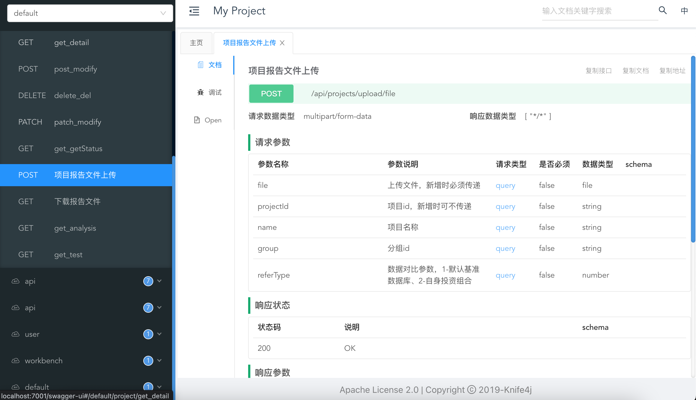

# midwayjs swagger knife4j2

## Example

访问地址: {host}/swagger-ui/index.html



## Thanks to [@nestjs/swagger](https://github.com/nestjs/swagger)

## Usage
```dotnetcli
// configuration.ts
import * as swagger from 'midwayjs-knife4j2';

...

@Configuration({
  imports: [
    {
      component: swagger,
      enabledEnvironment: ['local', 'dev'],
    }
  ]
})
...

// xxx.controller.ts
import { ApiResponse } from 'midwayjs-knife4j2';

...
@Get('/overview')
@ApiResponse({
  status: 200,
  description: '控制台',
  type: WorkbenchDto,
})
async getOverview(): Promise<WorkbenchDto> {
  return this.workbenchService.getData();
}
...
```

this is a sub package for midway.

Document: [https://midwayjs.org/docs/extensions/swagger](https://midwayjs.org/docs/extensions/swagger)

## License

[MIT]((https://github.com/fangbao-0418/midway/blob/master/LICENSE))
